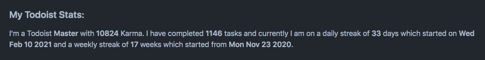

<p align="center">
  <h3 align="center">Todoist Stats</h3>
  
  <p align="center">Update your Todoist Stats</p>
</p>

---
## Setup

### Prep work

1. You'll need a Todoist API Token. You can get that from [here](https://todoist.com/prefs/integrations)
   - if you're new to Todoist, then you can refer [here](#new-to-todoist).
2. You need to save the Todoist API Token in the repository secrets. You can find that in the Settings of your Repository. Be sure to save those as the following.
   - `TODOIST_API_KEY = <your todoist API token>`
3. You need to update the README file (README.md) with some tags. You can refer [here](#update-your-readme) for updating it.

## New to Todoist

Todoist gives you the confidence that everything’s organized and accounted for, so you can make progress on the things that are important to you.

- Create a Todoist account from [here](https://todoist.com/users/showregister)
- Get your Todoist API Key from your [here](https://todoist.com/prefs/integrations)

### Repository Workflow

Please follow the steps below:

1. Go to your `<username>/<username>/actions`, hit `New workflow`, `set up a workflow yourself`, delete all the default content github made for you.
2. Copy the following code and paste it to your new workflow you created at step 1:

```yml
name: README with Todoist

on:
  workflow_dispatch:
  schedule:
    # Runs every minute; change it as you like
    - cron: "* * * * *"

jobs:
  update-readme:
    name: Update todoist stats
    runs-on: ubuntu-latest
    steps:
      - uses: actions/checkout@v2
      - uses: SiddharthShyniben/todoist-readme@0.0.1
        with:
          TODOIST_API_KEY: ${{ secrets.TODOIST_API_KEY }}
          PREMIUM: "" # If you are premium, set it to true, else leave as is
```

> Don't forget to change the PREMIUM property to true if you are a premium member of Todoist.

3. Go to your repo secrets by hitting `Settings => Secrets` tab in your profile repo. You can also enter the url `https://github.com/<username>/<username>/settings/secrets` . Please replace the `<username>` with your own username.
4. Create a new `Secret`. `Name`: `TODOIST_API_KEY`, `Value`: Paste the Todoist API Token here. If you don't know what is the token, please go to [here](https://todoist.com/prefs/integrations) to find your API Key there.
5. Add tags to your `README.md`. See [below](#update-your-readme)
6. Go to Workflows menu (mentioned in step 1), click `README with Todoist`, and click `Run workflow`.
7. Go to your profile page. you will be able to see the updates.

## Update your README

Add tags to your `README.md` like this:

```markdown
# Todoist Stats

Hello, my name is Siddharth. I am a Todoist <td-kl></td-kl>
```

The tags will automagically get filled with the specified stats. <u>**_This gives you the power to place your stats in any design you like;_**</u> You can make the stats bold by doing `**<td-kl></td-kl>**` for example.

### Available tags:

* `<td-k>`: Yout Todoist karma count.
* `<td-kc>`: Yout Todoist karma count, in compact form (If you have 10,000 karma, It will be displayed as 10k).
* `<td-kl>`: Your Todoist Karma level
* `<td-ttc>`: The number of tasks you have ever completed in Todoist 
* `<td-cdsc>`: The number of days you have completed your daily goal (known as a daily streak)
* `<td-cdsf>`: The day on which your current Todoist daily streak has started
* `<td-cdst>`: The day on which your current Todoist daily streak has ended (most of the time this will be today or yesterday)
* `<td-cwsc>`: The number of weeks you have completed your weekly goal (known as a weekly streak)
* `<td-cwsf>`: The day on which your current Todoist weekly streak has started
* `<td-cwst>`: The day on which your current Todoist daily streak has ended (most of the time this will be this week or last week)
* `<td-mdsc>`: The length of your longest daily streak
* `<td-mdsf>`: The day on which your longest Todoist daily streak has started
* `<td-mdst>`: The day on which your longest Todoist daily streak has ended
* `<td-mwsc>`: The length of your longest weekly streak
* `<td-mwsf>`: The day on which your longest Todoist weekly streak has started
* `<td-mwst>`: The day on which your longest Todoist daily streak has ended
* `<td-ka>`: A list showing your Todoist Karma activity. There is a known bug: You need to adda single line directly above the element. This is because the `<td-ka>` element is considered as a block element by default, and the markdown inside block elements won't be parsed. Adding a line above makes the element inline (I guess??).
  Example: 
  ```markdown
  Here's a log of my activity...
  <td-ka></td-ka>
  ```
* _More coming soon..._


## License

This work is licensed under GNU General Public License v3.0